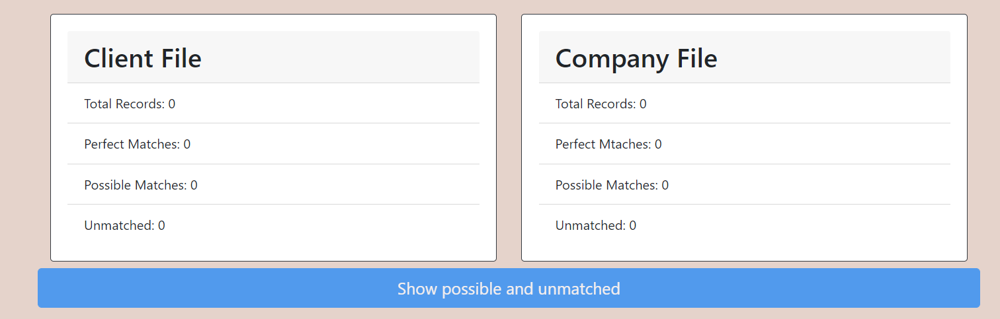
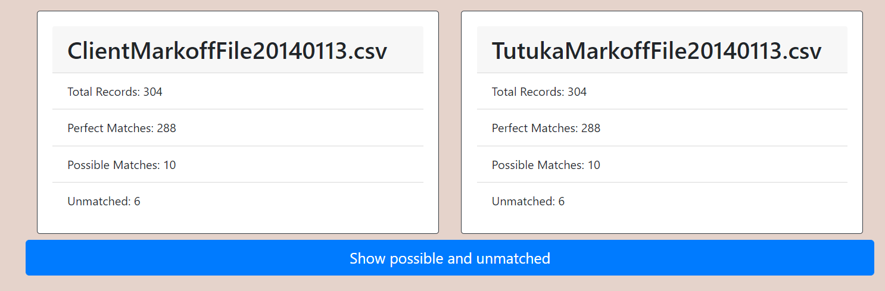
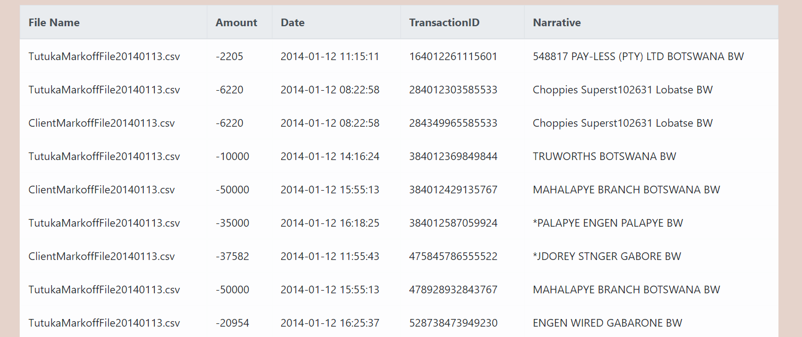
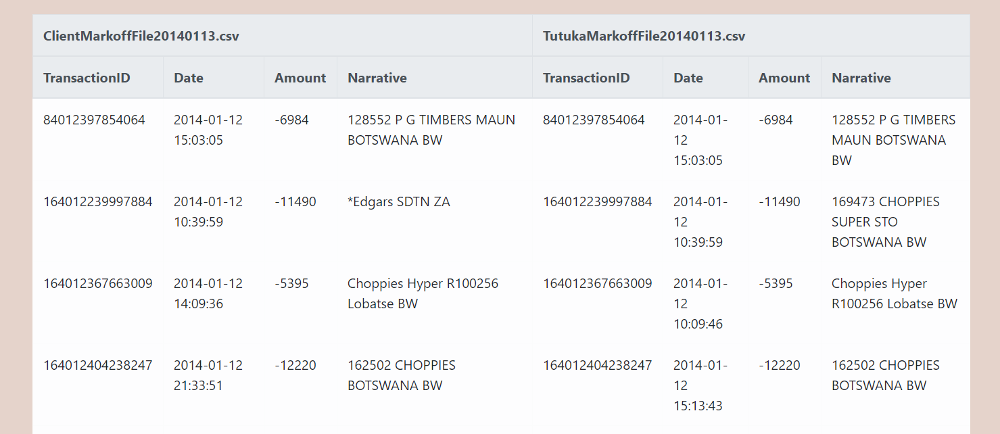

# Transaction Compare

### Objective
Making a web application where a financial reconciliation between 2 datasets (csv files). One is the client's trasanctions file and the other one may be the company's transactions file.  This application will show how many perfect matches, possible matches and unmatched reports are on each file. Display a table with the unmtached reports and which file they are located. Also a possible match table to show which reports may have a match on the other file and show them both.

### How it works...
On the main page you will see two buttons you can use to browse and pick the csv files you want to reconciliate. Once you choose both, click on the "Upload Files" button.

Scrolling down the page yo will find out to boxes where the results will be displayed after you upload both files.

This is how it looks after the app has finished processing your files. You will be able how may records each files has, number of perfect matches, possible matches and unmatched.

The blue button that is below the results will become available to click it. This button will display two tables.
The first table will show all the transactions that don't have a match. At the end of the table you will see a caption for you to know what does that table represents.

The second table will show reports that they possible have a match. A possible match is the same Transaction ID but maybe one of the columns has a different value in a file.
On the table yo will see on the left side the reports of one file and on the right its possible match with the other file.

